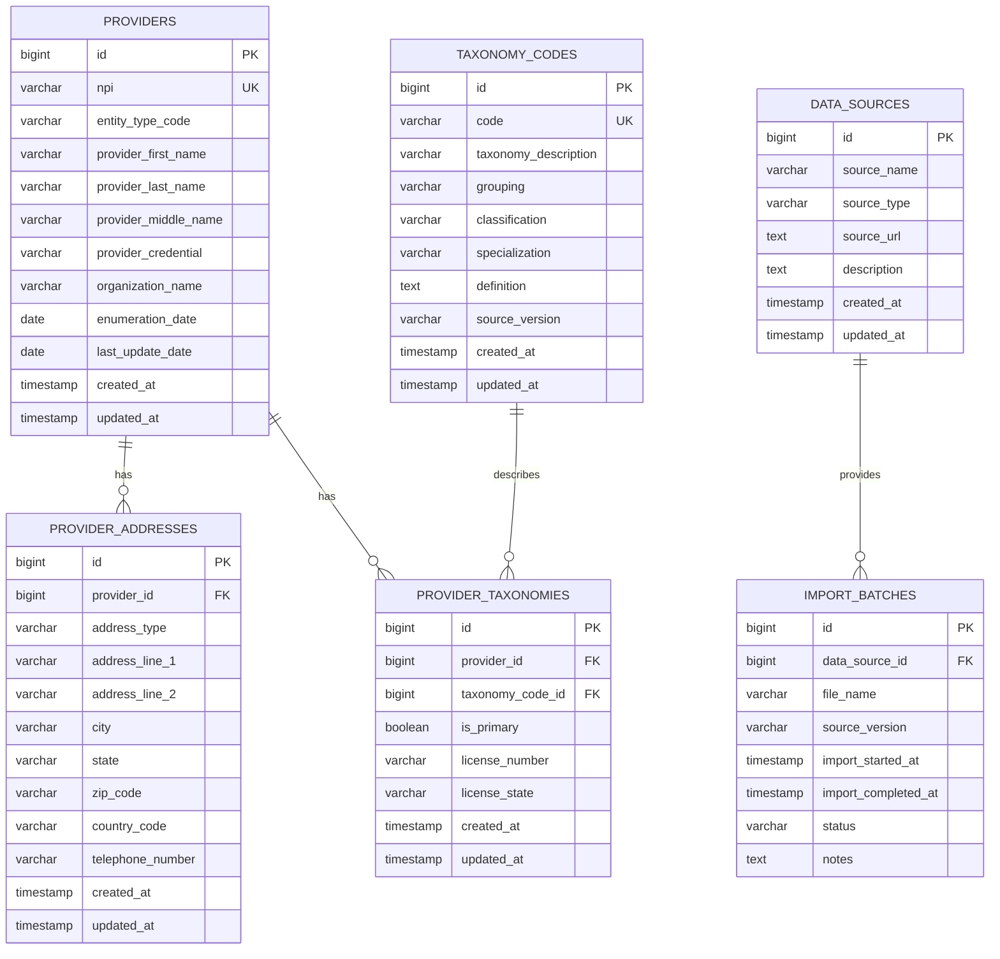

# Provider Lookup Database Design - Mermaid ERD

This document provides the initial Mermaid ERD for the EMRTS Provider Lookup project.

The goal of this database design is to support a simplified healthcare provider search application based on public provider data sources.

## Search Fields

The first version of the provider lookup application focuses on six search fields:

- Taxonomy Description
- Provider First Name
- Provider Last Name
- City
- State
- Zip Code

## Public Data Sources

The database design is based on the following public data sources:

- CMS NPPES downloadable data files
- NUCC Health Care Provider Taxonomy Code Set

## Design Principles

- Use system-assigned numeric IDs as primary keys.
- Store real-world identifiers, such as NPI numbers, as data fields.
- Do not use NPI or other real provider data as primary keys.
- Add NOT NULL constraints only to required identifier, relationship, search, source, import-tracking, and timestamp fields.
- Keep optional NPPES fields nullable because some fields may be missing or may depend on whether the provider is an individual or an organization.
- Keep provider identity, address, taxonomy, and import tracking data in separate tables.
- Keep the first version focused on the simplified provider search workflow.
- Prepare the design for future Django and PostgreSQL implementation.

## Initial ERD

## Required Fields Strategy

The PostgreSQL schema and DBML ERD apply `NOT NULL` to required fields only.

| Table | Required Fields |
| --- | --- |
| `providers` | `npi`, `entity_type_code`, `created_at`, `updated_at` |
| `provider_addresses` | `provider_id`, `address_type`, `city`, `state`, `zip_code`, `created_at`, `updated_at` |
| `taxonomy_codes` | `code`, `taxonomy_description`, `created_at`, `updated_at` |
| `provider_taxonomies` | `provider_id`, `taxonomy_code_id`, `is_primary`, `created_at`, `updated_at` |
| `data_sources` | `source_name`, `source_type`, `source_url`, `created_at`, `updated_at` |
| `import_batches` | `data_source_id`, `file_name`, `import_started_at`, `status` |

Optional fields remain nullable where the source data may be incomplete or where the field depends on provider type.

## Search Support

This initial database model supports the required simplified search fields.

| Search Field | Main Table | Main Column |
| --- | --- | --- |
| Taxonomy Description | `taxonomy_codes` | `taxonomy_description` |
| Provider First Name | `providers` | `provider_first_name` |
| Provider Last Name | `providers` | `provider_last_name` |
| City | `provider_addresses` | `city` |
| State | `provider_addresses` | `state` |
| Zip Code | `provider_addresses` | `zip_code` |

## Database Design Notes

The `providers` table stores the main provider identity information from the CMS NPPES downloadable data files. The `id` column is the primary key. The `npi` column is unique and required, but it is not used as the primary key.

The `provider_addresses` table stores provider address information. This supports location-based search by city, state, and zip code.

The `taxonomy_codes` table stores taxonomy code information from the NUCC Health Care Provider Taxonomy Code Set.

The `provider_taxonomies` table connects providers with taxonomy codes. This supports search by taxonomy description and allows one provider to have multiple taxonomy codes.

The `data_sources` and `import_batches` tables are included to track public source files and future data import activity.

## Next Steps

1. Review the NPPES downloadable file fields in more detail.
2. Review the NUCC taxonomy code fields in more detail.
3. Confirm the minimum fields needed for the first working version.
4. Continue refining DBML, Mermaid, and PostgreSQL schema documentation as needed.
5. Begin Django application setup after the database direction is reviewed.
6. Build a clean and professional provider search interface.
