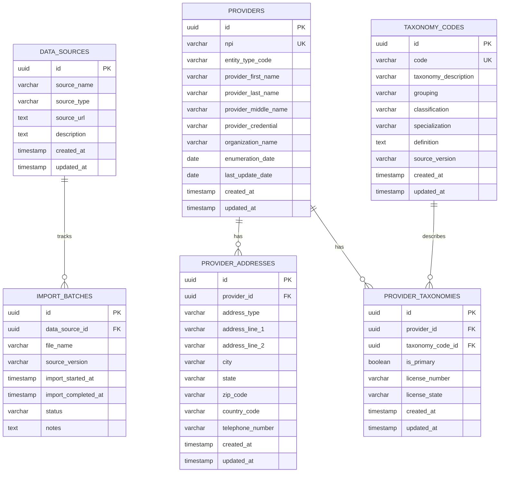

# Provider Lookup ERD

Primary keys use UUIDs. Real-world identifiers such as NPI numbers and taxonomy codes are stored as unique data fields, not primary keys.

## Design Notes

- UUID primary keys are used for internal database identity.
- NPI numbers remain unique provider identifiers, but they are not primary keys.
- NUCC taxonomy codes remain unique taxonomy identifiers, but they are not primary keys.
- Provider identity, address, taxonomy, data source, and import tracking data are stored in separate tables.
